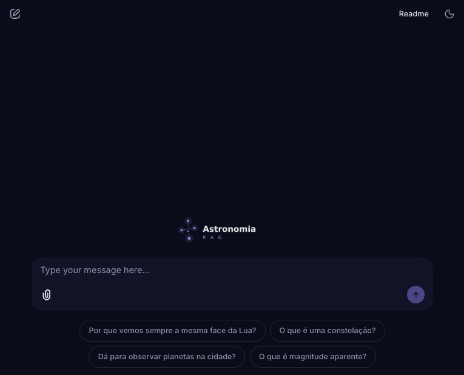

# `Astronomia RAG`

<p align="center">
  
  
  
  
</p>

<br>

[Relatório Final](https://raw.githubusercontent.com/cintia-shinoda/astronomia-rag/main/Relatorio-Final.pdf)

Sistema de perguntas e respostas (FAQ) sobre Astronomia Observacional baseado em Retrieval-Augmented Generation (`RAG`), com busca vetorial em `FAISS`, LLM local (`Mistral-7B`) e pipeline de processamento construído com `LangChain`.

<div>

</div>

<br>

<div>

</div>

---


## Estrutura do Repositório

```bash
astronomia-rag/
├── data/
│   └── corpus/
│
├── docs/
│
├── evals/
│   ├── eval_results.json
│   ├── golden_set.json
│   ├── preencher_notas.py
│   └── run_evals.py
│
├── notebooks/
│
├── src/astronomia_rag/
│   ├── __init__.py
│   ├── chain.py
│   ├── cli.py
│   ├── config.py
│   ├── indexer.py
│   ├── memory.py
│   └── retriever.py
│
├── tests/
│   └── test_retriever.py
│
├── app.py
│
├── .gitignore
├── pyproject.toml
└── README.md
```

---

## Corpus
Os 15 documentos do corpus foram redigidos como material educacional conciso, com auxílio de IA, a partir de conhecimento consolidado de Astronomia.


---

## Interface Web
Interface de chat no navegador, para quem não tem familiaridade com terminal.
Mostra as fontes de cada resposta e traz perguntas-exemplo para começar.
Abre em http://localhost:8000 (requer o Ollama rodando e o índice já criado).

```bash
pip install chainlit

chainlit run app.py -w
```

---

## Como executar:
### Requisitos:
- Python 3.10+
- Ollama

1. Clone o repositório e instale as dependências:
```bash
git clone https://github.com/cintia-shinoda/astronomia-rag.git

cd astronomia-rag

pip install -e ".[dev]"
```

2. Download do modelo via Ollama:
```bash
ollama pull mistral
```

3. Rodar o pipeline de RAG via CLI:
```bash
python -m astronomia_rag.indexer
python -m astronomia_rag.cli
```
